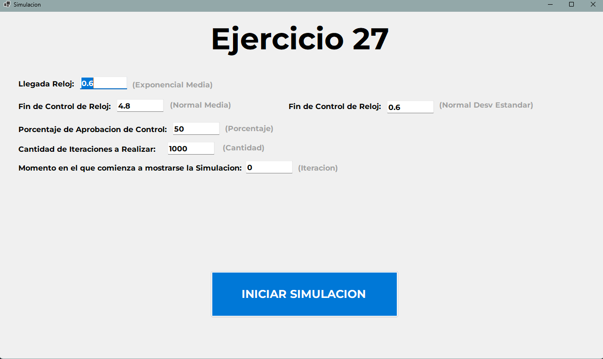
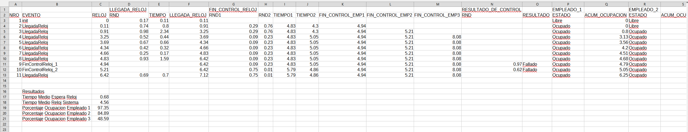

# Simulación de Control de Calidad - Ejercicio 27

## Enunciado

> En un sistema de control de calidad de una fábrica de relojes, trabajan **tres personas** que controlan los relojes.  
> El tiempo de llegada de cada reloj sigue una **distribución exponencial**, con un tiempo entre llegadas promedio de **0,01 horas**.  
> Los relojes se controlan de uno en uno, a medida que van llegando.  
> El tiempo necesario para controlar un reloj tiene una **distribución normal**, con **media 0,08 horas** y **desviación estándar 0,01 horas**.  
>
> Se requiere determinar:
> 1. El tiempo medio que debe esperar un reloj antes de ser controlado.  
> 2. El tiempo total promedio de un reloj en el sistema, desde que entra para ser controlado hasta que sale (Ok o fallado).  
> 3. El porcentaje de utilización de cada uno de los operarios que controlan los relojes.

---

## Descripción del Proyecto

Este proyecto es una **simulación interactiva** desarrollada en **C#** para resolver el problema planteado. Permite ajustar parámetros clave del control de calidad y genera los resultados en un archivo Excel.

### Tecnologías utilizadas:

- 💻 Lenguaje: **C#**  
- 📄 Salida: **Archivo Excel (.csv)**  
- 📊 Interfaz Gráfica: **WinForms/WPF**  

---

## Funcionamiento

1. El usuario ingresa los parámetros de simulación:  
   - Cantidad de relojes a controlar  
   - Distribución de tiempo entre llegadas (exponencial)  
   - Tiempo de control de cada reloj (normal)  
   - Número de operarios  
2. Se simula el flujo completo desde que los relojes llegan hasta que son controlados.  
3. Se calcula:  
   - Tiempo medio de espera antes de ser controlado  
   - Tiempo total promedio en el sistema  
   - Porcentaje de utilización de cada operario  
4. Se genera un archivo **ResultadosSimulacion.csv** con todos los eventos y resultados.

---

## Interfaz de Usuario

### Pantalla Principal

---

## Ejemplo de Resultados

---

## Autor

Proyecto realizado como parte del curso de **Simulación**, Ejercicio 27.
